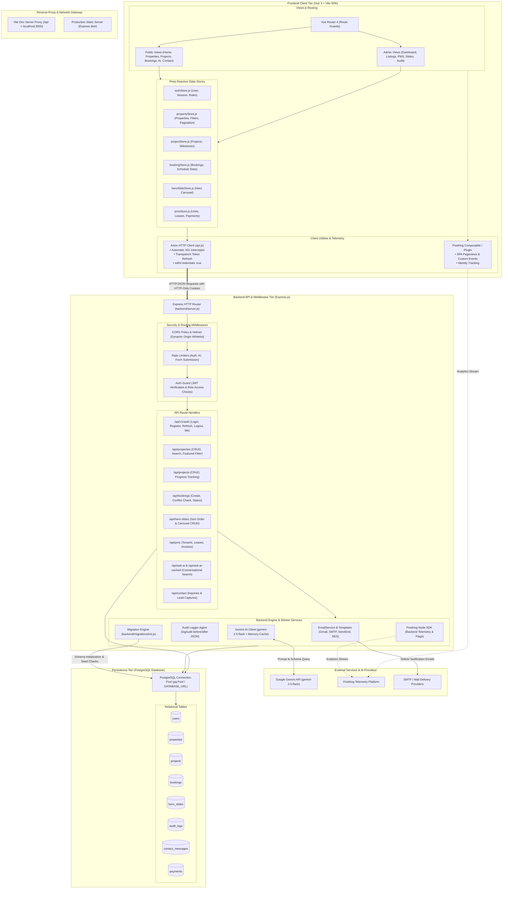
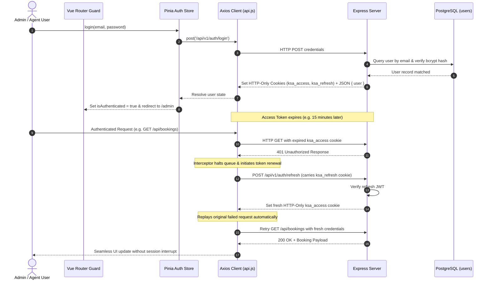
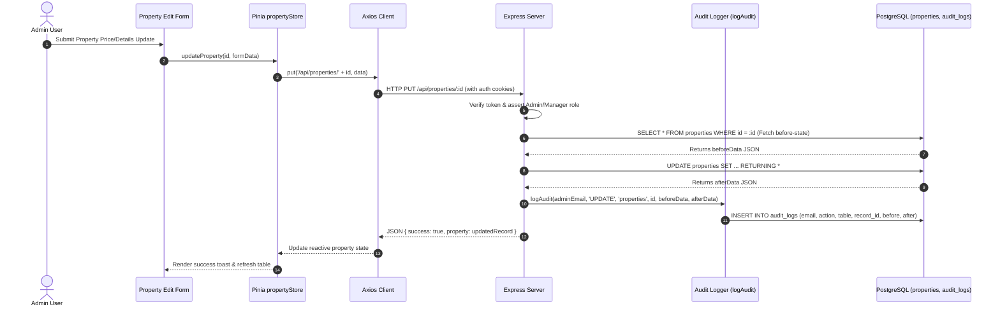
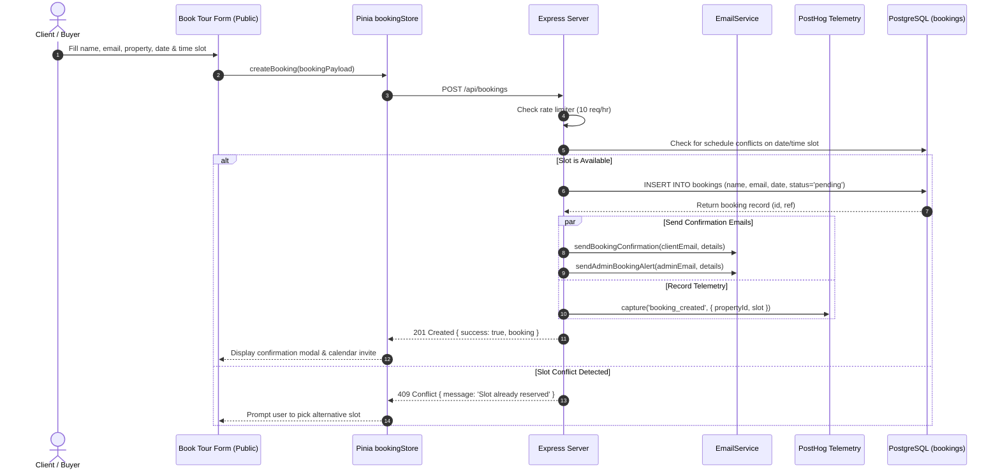
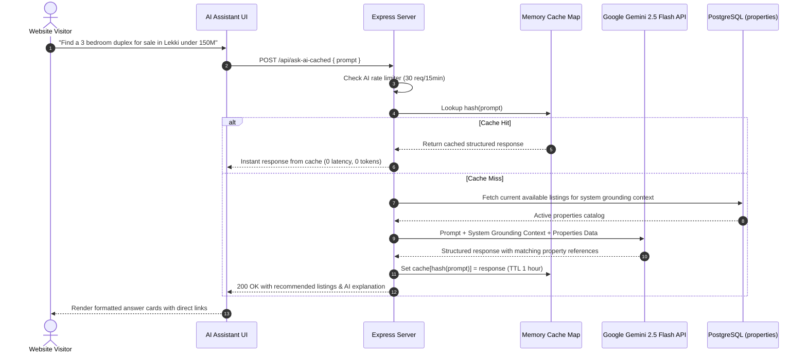

# AGENTS.md - KSA Valuers Architecture Guide

This document describes all active services, backend API endpoints, state stores, and persistence systems in the KSA Valuers project, as well as currently non-functional, mocked, or broken parts of the system.

---

## 📋 Table of Contents
- [1. Frontend Services & State Management](#1-frontend-services--state-management)
- [2. Backend API Agents](#2-backend-api-agents)
- [3. Core Backend Services & Utilities](#3-core-backend-services--utilities)
- [4. Non-Functional, Mocked, & Broken Components](#4-non-functional-mocked--broken-components)
- [5. Communication Patterns & Data Flow](#5-communication-patterns-and-data-flow)

---

## 1. Frontend Services & State Management

### **Pinia Stores** (State Management)

#### A. **Auth Store** (`src/stores/authStore.js`)
* **Purpose:** Manages administrator and agent authentication sessions.
* **Responsibilities:**
  - Login/logout execution and reactive error tracking.http://localhost:5173/http://localhost:5173/http://localhost:5173/
  - User self-service registration (signup).
  - Storing active user profile (id, email, role, name).
* **Key State:**
  ```javascript
  user: null            // Current logged-in user info
  isAuthenticated: false
  error: null           // Stores last login or session validation error
  ```

#### B. **Property Store** (`src/stores/propertyStore.js`)
* **Purpose:** Manages property listings and pagination metadata.
* **Responsibilities:**
  - CRUD operations (create, update, delete properties).
  - Pagination tracking and filter configurations.
  - Toggling featured status on specific properties.
* **Key State:**
  ```javascript
  properties: []        // Array of loaded properties
  totalProperties: 0    // Total records matching filters
  currentPage: 1
  totalPages: 1
  ```

#### C. **Project Store** (`src/stores/projectStore.js`)
* **Purpose:** Manages development projects and timeline milestones.
* **Responsibilities:**
  - Project CRUD and progress tracking (completion percentage).
  - Budget calculations and filter parameters.
* **Key State:**
  ```javascript
  projects: []          // List of development projects
  totalProjects: 0
  ```

#### D. **Booking Store** (`src/stores/bookingStore.js`)
* **Purpose:** Manages site viewing appointments.
* **Responsibilities:**
  - Loading pending, confirmed, completed, or cancelled bookings.
  - Validating slot overlaps and handling status updates.
* **Key State:**
  ```javascript
  bookings: []
  stats: { pending: 0, confirmed: 0, completed: 0, cancelled: 0 }
  ```

#### E. **Hero Slide Store** (`src/stores/heroSlideStore.js`)
* **Purpose:** Manages homepage hero banner slide options.
* **Responsibilities:**
  - Fetching active slide records sorted by sorting index hierarchy.
  - Adding, editing, and deleting slides with automatic refresh support.
* **Key State:**
  ```javascript
  slides: []            // Array of hero slide objects
  loading: false
  ```

### **HTTP API Client** (`src/services/api.js`)
* **Purpose:** Centralized Axios client with interceptors for server communications.
* **Key Features:**
  - **Vite Dev Server Proxy Routing:** The `API_BASE_URL` falls back to `""` in local development, natively proxying backend `/api` requests to `http://localhost:3000` via `vite.config.js`. This resolves cross-origin credential issues in tunneled/LAN testing.
  - **Token Refresh Interceptor:** Intercepts `401 Unauthorized` responses on administrative routes. If a refresh cookie exists, it automatically requests token renewal via `/api/v1/auth/refresh` and transparently retries the failed requests.
  - **Credential Routing:** Automatically sets `withCredentials: true` to forward access cookies.

### **PostHog Analytics Client & Composable** (`src/plugins/posthog.js`, `src/composables/usePostHog.js`)
* **Purpose:** Provides client-side analytics, user identity tracking, session telemetry, and feature flagging.
* **Key Features:**
  - **Zero-Crash Mock Fallback:** Automatically switches to safe mock mode in local/dev environments when `VITE_POSTHOG_KEY` is not present.
  - **SPA Pageview Capture:** Tracks page transitions and query params automatically on `router.afterEach`.
  - **Identity Lifecycle:** Synchronized with `authStore` to identify user profiles upon login/session load and reset sessions upon logout.

---

## 2. Backend API Agents

### Express.js Server (`backend/server.js`)
Main HTTP router built using Node.js and Express. Persists data to a PostgreSQL backend.

#### A. **Authentication API Agent**
* **Endpoints:**
  - `POST /api/v1/auth/login` → Authenticates email/password; returns JWT tokens set as HTTP-only cookies (`ksa_access`, `ksa_refresh`).
  - `POST /api/v1/auth/register` → Registers new admin/agent accounts with password strength policy checks and auto-seeding.
  - `POST /api/v1/auth/refresh` → Decodes refresh token and issues fresh auth cookies.
  - `POST /api/v1/auth/logout` → Clears HTTP-only credentials.
  - `GET  /api/v1/auth/me` → Returns active user profile.

#### B. **Properties API Agent**
* **Endpoints:**
  - `GET    /api/properties` → Paginated listing with SQL `ILIKE` search & status/type filters.
  - `GET    /api/properties/:id` → Single property details.
  - `POST   /api/properties` → Creates listing. (Guarded: Admin/Manager only)
  - `PUT    /api/properties/:id` → Updates fields. (Guarded: Admin/Manager only)
  - `DELETE /api/properties/:id` → Removes record. (Guarded: Admin/Manager only)

#### C. **Projects API Agent**
* **Endpoints:**
  - `GET    /api/projects` → Lists projects with type, status, and search filters.
  - `GET    /api/projects/:id` → Single project details.
  - `POST   /api/projects` → Creates new project. (Guarded: Admin only)
  - `PUT    /api/projects/:id` → Updates progress/budget. (Guarded: Admin only)
  - `DELETE /api/projects/:id` → Deletes project. (Guarded: Admin only)

#### D. **Bookings API Agent**
* **Endpoints:**
  - `GET    /api/bookings` → List of appointments. (Guarded: Admin/Agent only)
  - `POST   /api/bookings` → Creates viewing appointment (checks slot conflicts).
  - `PUT    /api/bookings/:id` → Modifies booking status. (Guarded: Admin/Agent only)

#### E. **Hero Slides API Agent**
* **Endpoints:**
  - `GET    /api/hero-slides` → Public slides list sorted by `sort_order`.
  - `POST   /api/hero-slides` → Creates slide. (Guarded: Admin/Manager only)
  - `PUT    /api/hero-slides/:id` → Updates slide properties. (Guarded: Admin/Manager only)
  - `DELETE /api/hero-slides/:id` → Deletes slide. (Guarded: Admin/Manager only)

#### F. **Gemini AI Agent**
* **Endpoints:**
  - `POST /api/ask-ai` → Submits search query to Google Gemini API using `gemini-2.5-flash`.
  - `POST /api/ask-ai-cached` → Accesses Gemini answers with local Map-based cache to minimize API token usage.

---

## 3. Core Backend Services & Utilities

### **Database Agent (PostgreSQL)**
* **Driver:** `pg` pool connecting via `DATABASE_URL`.
* **Migrations Manager (`backend/migrations/init.js`):** Automatically checks schema migrations on server startup. Creates tables: `users`, `properties`, `projects`, `bookings`, `contact_messages`, `audit_logs`, and `hero_slides`.
* **Password Policy Enforcement:** Validates administrator passwords on startup (minimum 12 chars, mixed case, numbers, special characters).

### **Email Service Factory (`backend/services/emailService.js`)**
* **Driver:** Nodemailer with factory interface.
* **Transporter Providers:** Configurable in `.env` using `EMAIL_PROVIDER`:
  - `gmail`: Standard Gmail OAuth2/app-pass setup.
  - `smtp`: Custom mail servers.
  - `sendgrid` / `aws-ses`: Integrated transactional service support.
* **Templates Engine (`backend/services/emailTemplates.js`):** Loads compiled HTML scripts for user contact inquiries, booking approvals, and audit notices.

### **Audit Logger Agent**
* **Function:** `logAudit(userEmail, action, tableName, recordId, beforeData, afterData)`
* **Description:** Persists before/after JSON structures inside the `audit_logs` table for mutations (insert/update/delete) in properties, projects, bookings, and hero slides.

### **PostHog Backend Telemetry Service (`backend/services/posthogService.js`)**
* **Driver:** `posthog-node` client wrapper.
* **Methods:** `capture({ distinctId, event, properties })`, `identify({ distinctId, properties })`, `isFeatureEnabled(key, distinctId)`, `shutdown()`.
* **Description:** Provides telemetry for backend audit events, transaction mutations, and server-side feature flags with automatic mock mode fallback when keys are absent.

### **Security & Rate Limiting Middleware**
* **CORS Policy:** Restricts connections to dynamic domains in `ALLOWED_ORIGINS` (enforces HTTPS in production environments).
* **AI Limiter:** Restricts AI interactions to 30 queries per 15 minutes per IP.
* **Form Limiter:** Restricts contact messages & bookings to 10 submissions per hour per IP.

---

## 4. Non-Functional, Mocked, & Broken Components

The following components represent legacy code, simulation fallbacks, or structural defects that require future code refactoring:

### A. **Broken Vue Error Boundary Hook**
* **Location:** `src/components/global/ErrorBoundary.vue`
* **Defect:** The local function `errorCaptured` is declared in `<script setup>` but never bound to the Vue lifecycle runtime (should import and use `onErrorCaptured`). Any rendering exceptions inside this boundary fail silently without triggering the fallback UI.

### B. **Duplicate Error Boundary Code**
* **Locations:** `src/components/ErrorBoundary.vue` & `src/components/global/ErrorBoundary.vue`
* **Redundancy:** There are two duplicate error boundary implementations with different CSS layout styles. App.vue uses one, while pages import the other.

### C. **Simulated Chat Widget on Contact Page**
* **Location:** `src/views/Contact.vue`
* **Mock Behavior:** The "Live Chat Support" widget uses a mocked `setTimeout` reply instead of querying the backend Gemini AI agent endpoint (`/api/ask-ai`).

### D. **Missing Backend Graceful Shutdown Signals**
* **Location:** `backend/server.js`
* **Defect:** The Express server processes exit immediately when receiving termination signals (`SIGINT`, `SIGTERM`). PostgreSQL database connection pool slots remain dangling until they time out naturally on the database server.

---

## 5. System Architecture & Component Wiring

The following diagram illustrates how all frontend layers, stores, network clients, backend middlewares, service agents, external third parties, and the persistence tier are interconnected.



---

## 6. End-to-End Workflow & Data Flow Diagrams

### A. Authentication & Transparent Token Refresh Cycle



### B. Admin Mutation & Audit Trail Pipeline



### C. Site Viewing Booking & Notification Pipeline



### D. AI Assistant Query & Multi-Tier Caching Flow


